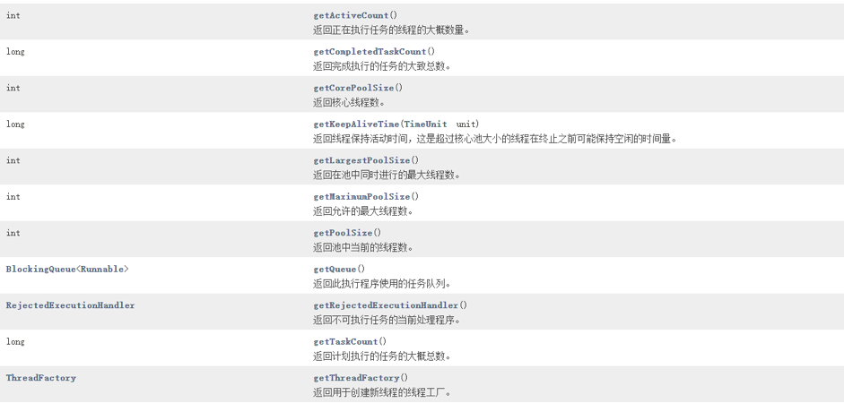

## 线程池监控

### 继承ThreadPoolExecutor 重写方法

> ThreadPoolExecutor 提供了beforeExecute,afterExecute,terminated方法，可以扩展这些方法，统计线程池相关属性

```java

/**
 * @Description 线程池监控
 * @Author pengmin
 * @Date 2021/10/22 5:29 下午
 **/
public class ThreadPoolExecutorForMonitor extends ThreadPoolExecutor {


    private static final String defaultPoolName = "Async-Task";


    public ThreadPoolExecutorForMonitor(int corePoolSize, int maximumPoolSize, long keepAliveTime, TimeUnit unit, BlockingQueue<Runnable> workQueue) {
        super(corePoolSize, maximumPoolSize, keepAliveTime, unit, workQueue);
    }

    public ThreadPoolExecutorForMonitor(int corePoolSize, int maximumPoolSize, long keepAliveTime, TimeUnit unit, BlockingQueue<Runnable> workQueue, ThreadFactory threadFactory) {
        super(corePoolSize, maximumPoolSize, keepAliveTime, unit, workQueue, threadFactory);
    }

    public ThreadPoolExecutorForMonitor(int corePoolSize, int maximumPoolSize, long keepAliveTime, TimeUnit unit, BlockingQueue<Runnable> workQueue, RejectedExecutionHandler handler) {
        super(corePoolSize, maximumPoolSize, keepAliveTime, unit, workQueue, handler);
    }

    public ThreadPoolExecutorForMonitor(int corePoolSize, int maximumPoolSize, long keepAliveTime, TimeUnit unit, BlockingQueue<Runnable> workQueue, ThreadFactory threadFactory, RejectedExecutionHandler handler) {
        super(corePoolSize, maximumPoolSize, keepAliveTime, unit, workQueue, threadFactory, handler);
    }


    //最短执行时间
    private long minCostTime;
    //最长执行时间
    private long maxCostTime;
    //总的耗时
    private AtomicLong totalCostTime = new AtomicLong();

    private ThreadLocal<Long> startTimeThreadLocal = new ThreadLocal<>();


    @Override
    public void shutdown() {
        super.shutdown();
    }

    @Override
    protected void beforeExecute(Thread t, Runnable r) {
        startTimeThreadLocal.set(System.currentTimeMillis());
        super.beforeExecute(t, r);
    }

    @Override
    protected void afterExecute(Runnable r, Throwable t) {
        long costTime = System.currentTimeMillis() - startTimeThreadLocal.get();
        startTimeThreadLocal.remove();
        maxCostTime = Math.max(maxCostTime, costTime);
        if (getCompletedTaskCount() == 0) {
            minCostTime = costTime;
        }
        minCostTime = Math.min(minCostTime, costTime);
        totalCostTime.addAndGet(costTime);
        super.afterExecute(r, t);
    }

    public long getMinCostTime() {
        return minCostTime;
    }

    public long getMaxCostTime() {
        return maxCostTime;
    }

    public long getAverageCostTime() {//平均耗时
        if (getCompletedTaskCount() == 0 || totalCostTime.get() == 0) {
            return 0;
        }
        return totalCostTime.get() / getCompletedTaskCount();
    }

    @Override
    protected void terminated() {
        super.terminated();
    }

```

### 监控参数



```java


        ThreadPoolExecutor threadPoolExecutor;
        Map<String, String> map=new LinkedHashMap<>();
        //核心线程数
        map.put("corePoolSize",String.valueOf(threadPoolExecutor.getCorePoolSize()));
        //最大线程数
        map.put("maximumPoolSize",String.valueOf(threadPoolExecutor.getMaximumPoolSize()));
        //当前线程池中正在执行任务的线程数量
        map.put("activeCount",String.valueOf(threadPoolExecutor.getActiveCount()));
        //线程池曾经创建过的最大线程数量
        map.put("largestPoolSize",String.valueOf(threadPoolExecutor.getLargestPoolSize()));
        //线程池当前的线程数量
        map.put("poolSize",String.valueOf(threadPoolExecutor.getPoolSize()));
        //任务总数:线程池已经执行的和未执行的任务
        map.put("taskCount",String.valueOf(threadPoolExecutor.getTaskCount()));
        //线程池已完成的任务数量
        map.put("completedTaskCount",String.valueOf(threadPoolExecutor.getCompletedTaskCount()));
        //等待任务数
        map.put("waitTaskCount",String.valueOf(threadPoolExecutor.getQueue().size()));

```