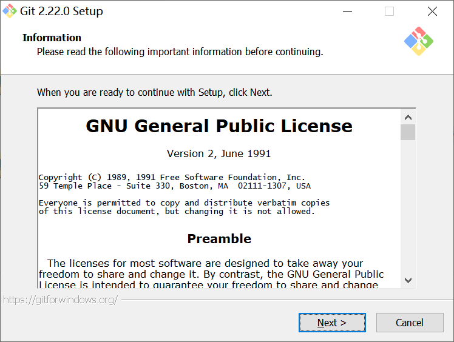
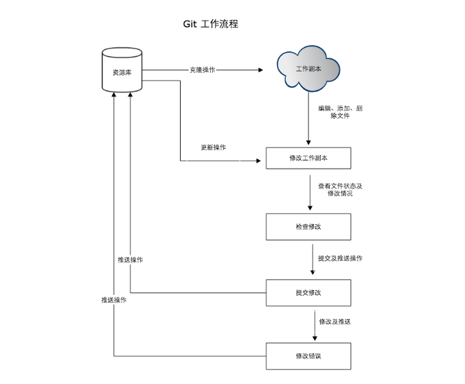
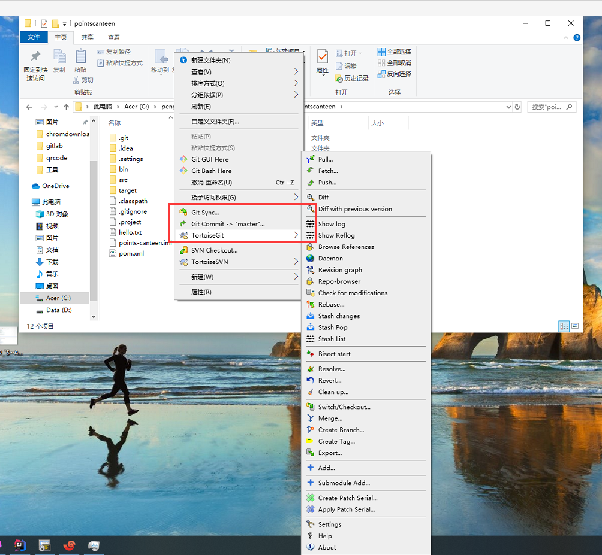

## git 使用指南

[TOC]

### 一、git 介绍

> C 语言编写的一个分布式版本控制系统

#### 1.git工作原理


```

1.Workspace：工作区:本地电脑存放项目文件的地方
2.Index / Stage：暂存区:在使用git管理项目文件的时候，其本地的项目文件会多出一个.git的文件夹，将这个.git文件夹称之为版本库。其中.git文件夹中包含了两个部分，一个是暂存区（Index或者Stage）,顾名思义就是暂时存放文件的地方，通常使用add命令将工作区的文件添加到暂存区里
3.Repository：仓库区（或本地仓库）:使用commit命令可以将暂存区中的文件添加到本地仓库中
4.Remote：远程仓库:不是在本地仓库中，项目代码在远程git服务器上，比如项目放在github上，就是一个远程仓库，通常使用clone命令将远程仓库拷贝到本地仓库中，开发后推送到远程仓库中即可

```

#### 2.git 和 svn 区别

- svn 集中式(有单独的服务器)


- git 分布式（每一台都可以存储）


#### 3.为什么说 git 是分布式的

```
  这里的“分布式”是相对于“集中式”来说的。把数据集中保存在服务器节点，所有的客户节点都从服务节点获取数据的版本控制系统叫做集中式版本控制系统，比如svn就是典型的集中式版本控制系统。

  与之相对，git的数据不止保存在服务器上，同时也完整的保存在本地计算机上，所以我们称git为分布式版本控制系统。

  git的这种特性带来许多便利，比如你可以在完全离线的情况下使用git，随时随地提交项目更新，而且你不必为单点故障过分担心，即使服务器宕机或数据损毁，也可以用任何一个节点上的数据恢复项目，因为每一个开发节点都保存着完整的项目文件镜像。

```


#### 4.git 和 svn 差异对比

| 差异点   | svn                                                                                                                                                                                                                    | git                                                                                                                                                                                                                                                                                  |
| :------- | :--------------------------------------------------------------------------------------------------------------------------------------------------------------------------------------------------------------------- | :----------------------------------------------------------------------------------------------------------------------------------------------------------------------------------------------------------------------------------------------------------------------------------- |
| 系统特点 | 1.集中式版本控制系统（文档管理很方便) <br /> 2.企业内部并行集中开发 <br />3.windows 系统上开发推荐使用<br />4.克隆一个拥有将近一万个提交(commit),五个分支,每个分支有大约 1500 个文件，用时将近一个小时                 | 1.分布式系统（代码管理很方便）<br />2.开源项目开发<br />3.mac,Linux 系统上开发推荐使用<br />4.克隆一个拥有将近一万个提交(commit),五个分支,每个分支有大约 1500 个文件，用时 1 分钟                                                                                                    |
| 灵活性   | 1.搭载 svn 的服务器出现故障，无法与之交互<br />2.所有的 svn 操作都需要中央仓库交互（例：拉分支，看日志等）                                                                                                             | 1.可以单机操作，git 服务器故障也可以在本地 git 仓库工作<br />2.除了 push 和 pull（或 fetch）操作，其他都可以在本地操作<br />3.根据自己开发任务任意在本地创建分支 4.日志都是在本地查看，效率较高                                                                                      |
| 安全性   | 较差，定期备份，并且是整个 svn 都得备份                                                                                                                                                                                | 较高，每个开发者的本地就是一套完整版本库，记录着版本库的所有信息（gitlab 集成了备份功能）                                                                                                                                                                                            |
| 分支方面 | 1.拉分支更像是 copy 一个路径<br/>2.可针对任何子目录进行 branch<br/>3.拉分支的时间较慢，因为拉分支相当于 copy<br/>4.创建完分支后，影响全部成员，每个人都会拥有这个分支<br/>5.多分支并行开发较重（工作较多而且繁琐）     | 1.我可以在 Git 的任意一个提交点（commit point）开启分支！（git checkout -b newbranch HashId）<br/>2.拉分支时间较快，因为拉分支只是创建文件的指针和 HEAD<br/>3.自己本地创建的分支不会影响其他人<br/>4.比较适合多分支并行开发<br/>5.git checkout hash 值(切回之前的版本，无需版本回退) |
| 版本控制 | 1.保存前后变化的差异数据，作为版本控制<br/>2.版本号进行控制，每次操作都会产生一个高版本号（svn 的全局版本号，这是 svn 一个较大的特点，git 是 hash 值）                                                                 | 1.git 只关心文件数据的整体发生变化，更像是把文件做快照，文件没有改变时，分支只想这个文件的指针不会改变，文件发生改变，指针指向新版本<br/>\2. 40 位长的哈希值作为版本号，没有先后之分                                                                                                 |
| 工作流程 | 1.每次更改文件之前都得 update 操作，有的时候修改过程中这个文件有更新，commit 不会成功<br/>2.有冲突，会打断提交动作（冲突解决是一个提交速度的竞赛：手快者，先提交，平安无事；手慢者，后提交，可能遇到麻烦的冲突解决。） | 1.开始工作前进行 fetch 操作，完成开发工作后 push 操作，有冲突解决冲突<br/>2.git 的提交过程不会被打断，有冲突会标记冲突文件                                                                                                                                                           |
| 学习成本 | 使用起来更方便，svn 对中文支持好，操作简单，适用于大众                                                                                                                                                                 | 更在乎效率而不是易用性，成本较高（有很多独有的命令，rebase，远程仓库交互的命令，等等）                                                                                                                                                                                               |
| 权限管理 | svn 的权限管理相当严格，可以按组、个人针对某个子目录的权限控制（每个目录下都会有个.svn 的隐藏文件）                                                                                                                    | git 没有严格的权限管理控制，只有账号角色划分                                                                                                                                                                                                                                         |


### 二、git安装

> 下载地址<https://git-scm.com/downloads>

#### 1.windows安装

> 一路next下去就行



> 验证git是否安装成功,在cmd下输入git


#### 2.mac安装

```
在 Mac 上安装 Git 有多种方式。 
最简单的方法是安装 Xcode Command Line Tools。 Mavericks （10.9） 或更高版本的系统中，在 Terminal 里尝试首次运行 git 命令即可。 如果没有安装过命令行开发者工具，将会提示你安装。

如果你想安装更新的版本，可以使用二进制安装程序。 官方维护的 OSX Git 安装程序可以在 Git 官方网站下载，网址为 http://git-scm.com/download/mac
```


### 三、git 常用命令

> git help可以看到全部命令

```
1. 初始化一个 git 仓库：git init
2. 克隆仓库：git clone <url>
3. 添加文件（提交到缓存区）：git add <file>
4. 提交文件（提交到 HEAD）：git commit -m <message>
5. 推送改动(提交到远程仓库)：git push orgin <branch_name>
6. 查看 git 仓库状态：git status
7. 查看修改内容：git diff
8. 查看提交日志：git log
9. 回复版本：git reset --hard <commit_id>
10. 创建分支：git branch <branch_name>
11. 切换分支: git check <branch_name> /git switch <branch_name>
12. 查看分支：git branch
13. 合并分支：git merge <branch_name>
14. 删除分支：git branch -d <branch_name>
15. 查看远程库信息：git remore -v
16. 显示标签：git tag
17. 新建标签：git tag <tag_name>
18. 新建带备注的标签：git tag -a <tag_name> -m <tag_message>
19. 给某个 commit 答标签：git tag -a <tag_name> <commit_id> -m <tag_message>

```


### 四、git分支

#### 1.常用分支

+ master(主分支)--》最稳定的版本

  ```
  1.主分支，与线上运行的版本始终保持一致，任何时候都不要直接修改master分支
  2.一个版本的release分支、hotfix分支开发完成后，会合并代码到master分支，也就是说master分支主要来源于release分支和hotfix分支
  ```

  

+ develop(开发分支)--》最新版本

  ```
  1.开发分支，始终保持最新完成以及bug修复后的代码，新增功能时基于该分支创建feature分支
  2.一个版本的release分支、hotfix分支开发完成后，也会合并到develop分支
  3.另外，一个版本的feature功能开发完成后，也会合并到develop分支。也就是说develop分支来源于feature、release、hotfix分支
  ```

+ feature(特性分支)--》实现新特性(需求)

  ```
  1.开发新功能或优化现有功能时，会创建feature分支，以develop为基础创建
  2.一般会有多个功能同时开发，但上线时间可能不同，在适当的时候将特定的feature分支合并到develop分支，并创建release分支，进入测试状态
  ```

  

+ release(发布分支)--》发布新版本

  ```
  1.当一组feature开发完成，会首先合并到develop分支，开始进入提测阶段时，会创建release分支。
  2.以release分支代码为基准提测，测试过程中若存在bug需要修复，则直接由开发者在release分支修复并提交。
  3.测试完成之后，合并release分支到master和develop分支，此时master为最新代码，用作上线
  ```

  

+ hotfix(热修复分支)--》修复线上bug

  ```
  线上出现紧急问题时，需要及时修复，以master分支为基线，创建hotfix分支，修复完成后，需要合并到master分支和develop分支
  ```

+ qa(提交给测试人员的分支)

#### 2.分支开发流程


  ```
1.创建master分支(默认分支,相当于SVN的trunk)
2.从master分支拉一条develop分支,不过一般也不在该分支上提交代码
3.当我们需要开发某个需求时，需要从develop分支拉出一条feature分支,例如feature-name1,feature-name2，在这些分支上并行地开发具体需求
4.当需求开发完毕，并且自测通过之后，此时需要从 develop 分支上拉出一条 qa 分支，例如 qa-name1-name2，并将需要发布的特性从相关 feature 分支一同合并到 qa 分支上，随后将针对 qa 分支部署测试环境，测试工程师在该分支上做功能测试，开发工程师在该分支上修改 bug
5.测试通过之后,从 master 分支拉出一条 release 分支，例如 release1.0.0，并将qa-batchDeductionsPoints分支合并到release1.0.0，并部署到预发环境，再次验证以后，均无任何 bug，此时可将 release 分支部署到生产环境
5.待上线完成后,将release分支上同时合并到develop和master分支，并在master分支打上tag，例如v1.0.0
6.当生产环境发现bug时，我们需要从对应的tag上拉出一条hotfix分支(例如hotfix1.0.1).并在hotfix分支上代码合并到develo划入master分支，最后，在master分支打上tag(v1.0.1)
  ```

> 版本号的规范

```
对于版本号规范：
格式为：x.y.z，其中，x 用于有重大重构时才会升级，y 用于有新的特性发布时才会升级，z 用于修改了某个 bug 后才会升级
```


#### 3.branch和tag区别 

- tag 对应某次 commit, 是一个点，是不可移动的（类似里程碑）

- branch 对应一系列 commit，是很多点连成的一根线，有一个 HEAD 指针，是可以依靠 HEAD 指针移动的

> git 有 commit，为什么还要引入 tag？

```

"请把上周一的那个版本打包发布，commit号是6a5819e…"

"一串乱七八糟的数字不好找！"

如果换一个办法：

"请把上周一的那个版本打包发布，版本号是v1.2"

"好的，按照tag v1.2查找commit就行！"

所以，tag就是一个让人容易记住的有意义的名字，它跟某个commit绑在一起。


```


### 五、工作流程

```
1.对代码进行修改
2.完成了某项功能，提交（commit，只是提交到本地代码库），1-2可以反复进行，直到觉得可以推送到服务器上时，执行3
3.拉取（pull，或者用获取 fetch 然后再手动合并 merge）
4.如果存在冲突，解决冲突
5.推送（push），将数据提交到服务器上的代码库

```




### 六、git客户端

#### 1.GitHub for Desktop

> github官方推荐<https://desktop.github.com/>


#### 2.TortoiseGit

> 和svn的小乌龟类似




#### 3.Source Tree  

> 号称是最好用的Git GUI工具,需要翻墙


### 七、编辑器使用git

#### 1.Eclipse使用git

> 右键->team->commit

+ commit

  

  > 提交必须有备注

  

  

+ push
  
  > 右键->team->push branch
  
  
  
+ pull
 > 右键->team->pull

  

+ branch
 > 右键->team->branch

  

+ merage
 > 右键->team->merage

   


#### 2.idea使用git

+ commit
  > 右键->Git->CommitFile
  
  

  > 提交必须有备注

  
  
+ push/pull
  > 右键->team->push/pull
  
  

  > 右上角↑、↓(整个项目更新或者提交)

  
  
+ branch
  > 右键->Git->Repository->Branches
  
  

  > 右下角同样可以

  
  
+ merage
  > 右键->Git->Repository->Merage
  
  

+ 冲突解决
  > 和svn是一样的，对比之后，自行解决
  
  


### 八、gitlab 项目管理

1. 创建项目组

   

   ```
   私有库：只有被赋予权限的用户可见
   内部库：登录用户可以下载
   公开库：所有人可以下载
   ```

2. 添加项目组成员


3. 创建项目

   

4. 添加项目成员

   

5. 设置人员

> 人员权限

```
Guest(游客):可以创建issue、发表评论，不能读写版本库
Reporter(记者):可以克隆代码，不能提交
Developer(开发者):可以克隆代码、开发、提交、push
Master(主要维护者):可以创建项目、添加tag、保护分支、添加项目成员、编辑项目
Owner(所属者):可以设置项目访问权限 - Visibility Level、删除项目、迁移项目、管理组成员

```

> 具体可看 https://docs.gitlab.com/ee/user/permissions.html

### 九、参考文档

> https://www.liaoxuefeng.com/wiki/896043488029600
>
> https://juejin.im/entry/5b1faf61f265da6e5b7635b6
>
> https://www.bootcss.com/p/git-guide/
>
> <https://blog.csdn.net/xiaoguanyusb/article/details/79611647>
>
> https://git-scm.com/book/zh/v2
>
> https://www.jianshu.com/p/cbd8cf5e232d


