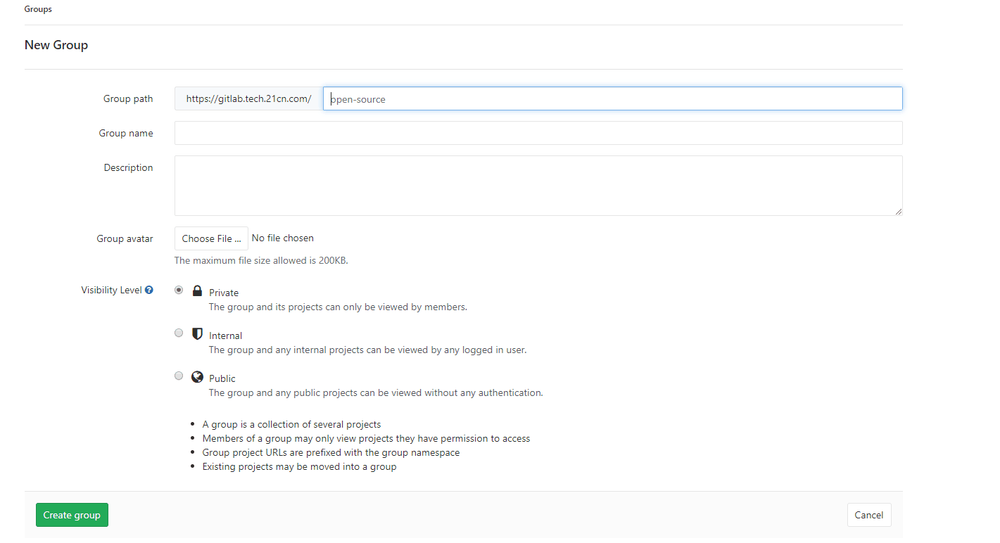
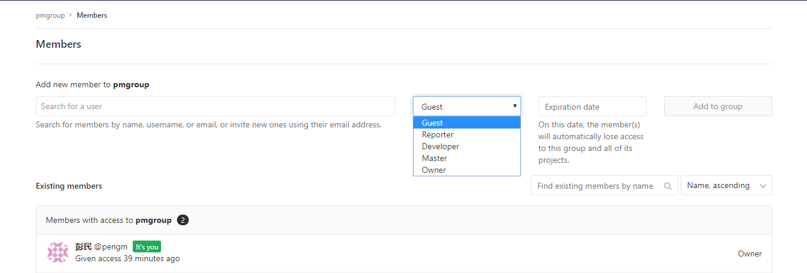
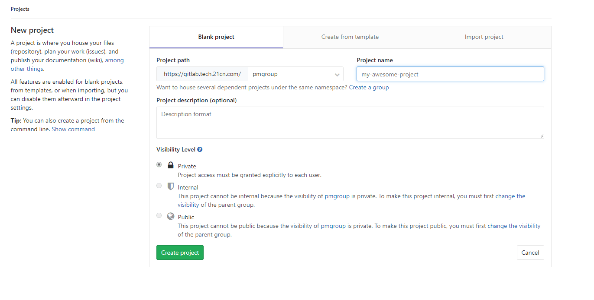
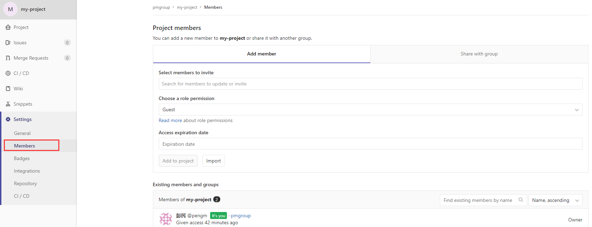

## git使用指南

### git介绍

> C语言编写的一个分布式版本控制系统

1. git工作原理


```

Workspace：工作区
Index / Stage：暂存区
Repository：仓库区（或本地仓库）
Remote：远程仓库

```

2.git和svn区别

+ svn集中式


+ git分布式


### git常用命令


1. 初始化一个git仓库：git init
2. 克隆仓库：git clone <url>
3. 添加文件（提交到缓存区）：git add <file>
4. 提交文件（提交到HEAD）：git commit -m <message>
5. 推送改动(提交到远程仓库)：git push orgin <branch_name>
6. 查看git仓库状态：git status
7. 查看修改内容：git diff
8. 查看提交日志：git log
9. 回复版本：git reset --hard <commit_id>
10. 创建分支：git branch <branch_name>
11. 切换分支: git check <branch_name> /git switch <branch_name>
12. 查看分支：git branch
13. 合并分支：git merge <branch_name>
14. 删除分支：git branch -d <branch_name>
15. 查看远程库信息：git remore -v
16. 显示标签：git tag
17. 新建标签：git tag <tag_name> 
18. 新建带备注的标签：git tag -a <tag_name> -m <tag_message>
19. 给某个commit答标签：git tag -a <tag_name> <commit_id> -m <tag_message>

### tag和branche的区别
+ tag 对应某次 commit, 是一个点，是不可移动的（类似里程碑）
+ branch 对应一系列 commit，是很多点连成的一根线，有一个HEAD 指针，是可以依靠 HEAD 指针移动的

```

Git有commit，为什么还要引入tag？

"请把上周一的那个版本打包发布，commit号是6a5819e…"

"一串乱七八糟的数字不好找！"

如果换一个办法：

"请把上周一的那个版本打包发布，版本号是v1.2"

"好的，按照tag v1.2查找commit就行！"

所以，tag就是一个让人容易记住的有意义的名字，它跟某个commit绑在一起。


```


### 工作流程

```
1.对代码进行修改
2.完成了某项功能，提交（commit，只是提交到本地代码库），1-2可以反复进行，直到觉得可以推送到服务器上时，执行3
3.拉取（pull，或者用获取 fetch 然后再手动合并 merge）
4.如果存在冲突，解决冲突
5.推送（push），将数据提交到服务器上的代码库

```


### gitlab项目管理

1. 创建项目组

   

   ```
   私有库：只有被赋予权限的用户可见
   内部库：登录用户可以下载
   公开库：所有人可以下载
   ```

2.  添加项目组成员

   

3. 创建项目

   

4. 添加项目成员

   

    ```
   
    ```


    ```


3. 设置人员

```
Guest:
Reporter:
Developer:
Master:
Owner:

```


### Eclipse使用git

### idea使用git

### 参考文档

> https://www.liaoxuefeng.com/wiki/896043488029600
> 
> https://www.bootcss.com/p/git-guide/

